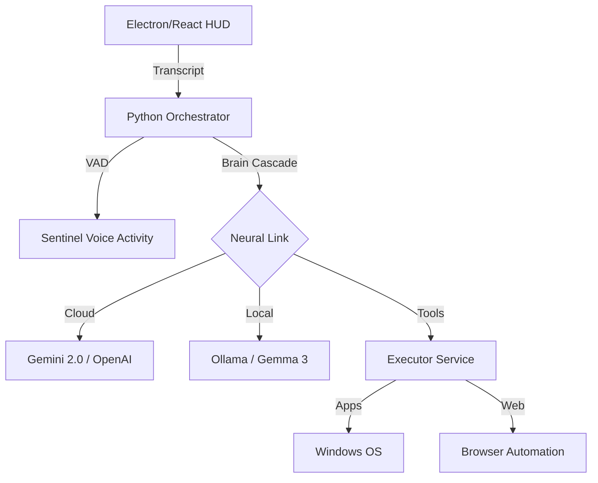

<div align="center">


# 🌸 Yuki Neural HUD
### **The F.R.I.D.A.Y.-Class Desktop Neural Assistant**

**Next-Gen HUD · Multi-Source Brains · Deep Windows Integration · 100% Reactive**

[](https://ai.google.dev/)
[](https://react.dev)
[](https://ollama.com)

---

**Yuki** is not just a voice assistant; she is a high-fidelity **Neural HUD** for your desktop. Built with an elite "Senior Designer" aesthetic, she transforms your Windows experience with a professional terminal-driven interface, reactive frequency waveforms, and a multi-brain cascade that ensures she never stops thinking.

[**Get Started**](#-quick-start) • [**Commands**](#-neural-commands) • [**Architecture**](#-neural-architecture) • [**Stability**](#-stability--fallbacks)

</div>

---

## ✨ Elite Features

### 🖥️ Neural Terminal HUD
*   **Command Line Interaction**: A monospaced terminal prompt (`>_`) for lightning-fast text and voice commands.
*   **HUD Segments**: Information is delivered in structured protocol blocks featuring asymmetric glowing borders and metadata headers.
*   **Real-time Streaming**: No waiting. Responses crawl onto the screen as Yuki thinks, providing a "living" interface experience.

### 🌊 Reactive Waveform
*   **Frequency Visualizer**: A 5-bar vertical visualizer integrated directly into the terminal.
*   **State-Aware**: The waveform shifts rhythms between **Listening** (high-amplitude), **Thinking** (scanning pulse), and **Speaking** (fluid oscillations).

### 🧠 Multi-Link Brain Cascade
*   **Primary Link**: **Gemini 2.0 Flash** for state-of-the-art reasoning and tool dispatching.
*   **Neural Fallback**: Automatic failover to **OpenAI GPT-4o** or **Local Ollama (Gemma 3:4B)** if cloud quotas are hit.
*   **Total Reliability**: Implemented circuit-breaker logic prevents "blackouts" by switching neural links in under 500ms.

---

## 🚀 Quick Start

### Prerequisites
- **Node.js 18+** & **Python 3.10+**
- **Ollama** (for local stability): `ollama pull gemma3:4b`
- **NVIDIA GPU** (Optional): Recommended for sub-second Whisper transcription.

### Installation
1.  **Clone & Install**:
    ```powershell
    git clone https://github.com/your-repo/yuki_assistant.git
    cd yuki_assistant
    npm install
    pip install -r requirements.txt
    ```
2.  **Configure Link**:
    Copy `.env.example` to `.env` and add your `GOOGLE_API_KEY`.
3.  **Launch**:
    ```powershell
    npm run electron:dev
    ```

---

## 🛠️ Neural Commands

Yuki supports deep OS automation out of the box.

| Command | Protocol Action |
| :--- | :--- |
| `Open YouTube` | Launches YouTube in default browser via Link Map |
| `Pause the song` | Triggers Global Media Control Protocol |
| `Set volume to 50` | Hardware sound modulation |
| `Send file to Mom` | Automated WhatsApp File Dispatcher |
| `Take a screenshot` | Captures Desktop to `%USERPROFILE%\Desktop` |
| `Weather in Tokyo` | Real-time weather segment fetching |

---

## 🛡️ Stability & Fallbacks

> [!IMPORTANT]
> **Neural Recharge (429 Handling)**: 
> If you hit the Gemini Free Tier limit, Yuki will automatically detect the "Resource Exhausted" signal and rewire her brain to **Ollama** (Local). Ensure Ollama is running (`ollama serve`) to maintain 100% uptime.

### Config Syncing
All settings are stored in `yuki.config.json`.
*   **Persistence Guard**: Yuki includes a hydration check to prevent UI restarts from resetting your custom ElevenLabs or Edge TTS settings.
*   **Auto-Healing**: Missing configuration blocks are automatically restored using system defaults during boot.

---

## 🏗️ Neural Architecture



---

## 🎨 Aesthetic Guidelines

Yuki follows the **"Neural Terminal"** design language:
- **Typography**: JetBrains Mono / Inter.
- **Color Space**: Deep Obsidian backgrounds with #00f2ff (Cyan) and #ff00ff (Magenta) accents.
- **FX**: Glassmorphism (Backdrop blur 12px), Asymmetric glow borders, and real-time frequency pulses.

---

<p align="center">
  Generated by <b>Antigravity AI</b> for <b>Yuki Assistant</b>.
</p>
