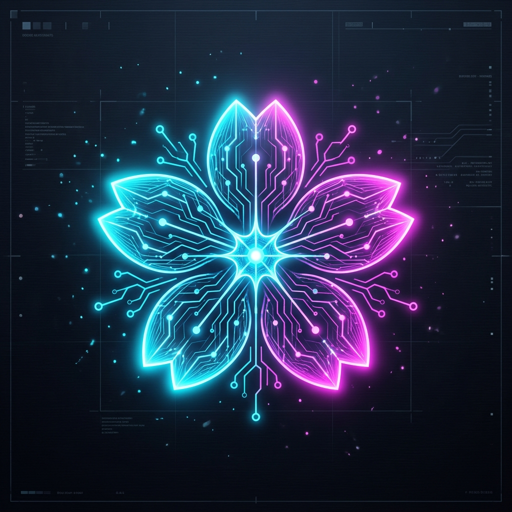
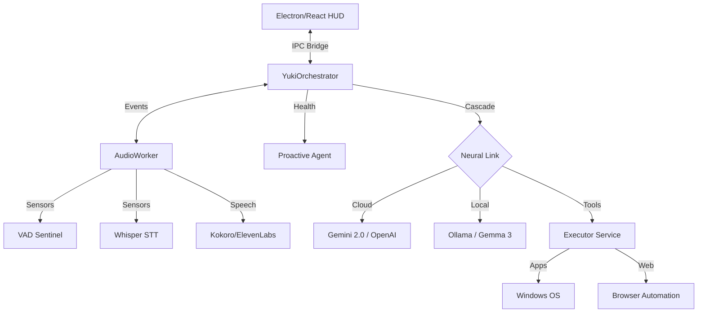

<div align="center">



# 🌸 Yuki Neural HUD
### **The F.R.I.D.A.Y.-Class Desktop Neural Assistant**

**Next-Gen HUD · Multi-Source Brains · Deep Windows Integration · 100% Reactive**

[](https://ai.google.dev/)
[](https://react.dev)
[](https://ollama.com)

---

**Yuki** is not just a voice assistant; she is a high-fidelity **Neural HUD** for your desktop. Built with an elite "Senior Designer" aesthetic, she transforms your Windows experience with a professional terminal-driven interface, reactive frequency waveforms, and a multi-brain cascade that ensures she never stops thinking.

[**Get Started**](#-quick-start) • [**Commands**](#-neural-commands) • [**Architecture**](#-neural-architecture) • [**Stability**](#-stability--fallbacks)

</div>

---

## ✨ Elite Features

### 🖥️ Neural Terminal HUD
*   **Command Line Interaction**: A monospaced terminal prompt (`>_`) for lightning-fast text and voice commands.
*   **HUD Segments**: Information is delivered in structured protocol blocks featuring asymmetric glowing borders and metadata headers.
*   **Real-time Streaming**: No waiting. Responses crawl onto the screen as Yuki thinks, providing a "living" interface experience.
31. 
32. ### 🌐 Observant Browser Research
33. *   **Self-Sensing Navigation**: Yuki doesn't just open links; she reads them. She can scrape live web content, parse DOM snippets, and provide summaries directly in the HUD.
34. *   **Nexus Bridge (CDP)**: Direct browser communication over Chrome DevTools Protocol for low-latency element interaction.
35. *   **Isolated Profiles**: Yuki maintains her own `.yuki_profile` to keep her agentic sessions separate from your personal browsing.

### 🌊 Local Neural Voice (Kokoro-82M)
*   **Zero-Latency Synthesis**: Yuki uses high-performance local TTS powered by **Kokoro-82M**, allowing her to respond instantly even without an internet connection.
*   **Hinglish Optimized**: Specially tuned to handle Hindi-English hybrid sentences with natural prosody.
*   **Reactive Waveform**: A 5-bar vertical visualizer reflects her speech patterns in real-time, shifting rhythms between **Listening**, **Thinking**, and **Speaking**.

### 🧠 Multi-Link Brain Cascade
*   **Primary Link**: **Gemini 2.0 Flash** for state-of-the-art reasoning and tool dispatching.
*   **Neural Economy**: Real-time monitoring of tokens and session cost via an integrated dashboard widget.
*   **Total Reliability**: Implemented circuit-breaker logic prevents "blackouts" by switching to **OpenAI GPT-4o** or **Local Ollama (Gemma 3)** in under 500ms.

### 💾 Semantic Memory & Passive Learner
*   **Dual-Layer Memory Vault**: Uses local JSON for instant configuration hydration and a **ChromaDB Vector Store** for persistent semantic fact indexing and context recall.
*   **Habit & Pattern Sensing**: Tracks tool usage patterns by the hour (`track_pattern`) to surface proactive alerts and learned routine suggestions on startup.
*   **Passive Learning Pipeline**: A background LLM filter parses conversation turns to extract and store user details, facts, and preferences without explicit "remember this" commands.

### 🛡️ Process Isolation (ToolWorker Gateway)
*   **Zero-Thread Lock**: Heavy, blocking operations (e.g., Playwright page loading, DOM parsing, WhatsApp dispatching) run in an isolated Python subprocess.
*   **Self-Healing Host**: If a subprocess tool hangs or exceeds execution limits, the main thread automatically restarts the gateway without interrupting speech synthesis or voice recognition.

### 🔌 Model Context Protocol (MCP) Server
*   **IDE Integration**: Turns Yuki into an MCP server (`python -m backend.mcp_server`). Connect your Claude Desktop, Cursor, or Windsurf directly to Yuki's brain to control Spotify, fetch files, or query calendar schedules via your editor.

---

## 🚀 Quick Start

### Prerequisites
- **Node.js 18+** & **Python 3.10+**
- **espeak-ng**: Required for local Kokoro-82M voice synthesis.
- **Ollama** (for local stability): `ollama pull gemma3:4b`
- **NVIDIA GPU** (Optional): Recommended for sub-second Whisper transcription and neural synthesis.

### Installation
1.  **Clone & Install**:
    ```powershell
    git clone https://github.com/gamerboy74/Yuki-Assistant.git
    cd yuki_assistant
    npm install
    pip install -r requirements.txt
    ```
2.  **Launch**:
    ```powershell
    npm run electron:dev
    ```
3.  **Link Your Brain**:
    Once the HUD boots, click the **Settings (Cog)** icon. Paste your API keys (Google, OpenAI, or ElevenLabs) directly into the interface. 
    
    > [!TIP]
    > Yuki automatically generates and manages your `yuki.config.json` file. You can also reference `yuki.config.json.example` for manual setup.

### 🔧 Developer Setup (Advanced Features)

#### 1. Setup Semantic Memory (ChromaDB)
To enable long-term vector-based fact recall, install semantic dependencies:
```powershell
pip install chromadb sentence-transformers
```

#### 2. Run the MCP Server
To expose Yuki's tool suite to external LLM clients:
```powershell
python -m backend.mcp_server
```
Add the following to your Claude Desktop config (`%APPDATA%\Client-name\claude_desktop_config.json`):
```json
{
  "mcpServers": {
    "yuki-assistant": {
      "command": "python",
      "args": ["-m", "backend.mcp_server"],
      "cwd": "C:/path/to/yuki_assistant"
    }
  }
}
```

---

## 🛠️ Neural Commands

Yuki supports deep OS automation out of the box.

| Command | Protocol Action |
| :--- | :--- |
| `Open YouTube` | Launches YouTube in default browser via Link Map |
| `Search cricbuzz for scores` | **Observant Research**: Navigates, scrapes, and reports live data |
| `Pause the song` | Triggers Global Media Control Protocol |
| `Set volume to 50` | Hardware sound modulation |
| `Send file to Mom` | Automated WhatsApp File Dispatcher |
| `Take a screenshot` | Captures Desktop to `%USERPROFILE%\Desktop` |
| `Weather in Tokyo` | Real-time weather segment fetching |
| `Start my day` | **Proactive Agent**: Runs complete Morning Briefing (Weather, Calendars, System stats, News category) |
| `Sync Cursor with Yuki` | Triggers MCP stdio connection gateway |

---

## 🛡️ Stability & Fallbacks

> [!IMPORTANT]
> **Neural Recharge (429 Handling)**: 
> If you hit the Gemini Free Tier limit, Yuki will automatically detect the "Resource Exhausted" signal and rewire her brain to **Ollama** (Local). Ensure Ollama is running (`ollama serve`) to maintain 100% uptime.

### Config Syncing
All settings are stored in `yuki.config.json`.
*   **Proactive Agent**: An autonomous background layer monitors neural link health, API quotas, and system thermal levels, providing audible alerts if maintenance is required.
*   **Persistence Guard**: Yuki includes a hydration check to prevent UI restarts from resetting your custom ElevenLabs or Edge TTS settings.
*   **Auto-Healing**: Missing configuration blocks are automatically restored using system defaults during boot.

---

## 🏗️ Neural Architecture


```mermaid
graph TD
    UI[Electron/React HUD] <-->|IPC Bridge| ORC[YukiOrchestrator]
    ORC <-->|Events| AW[AudioWorker]
    AW -->|Sensors| VAD[VAD Sentinel]
    AW -->|Sensors| STT[Whisper STT]
    AW -->|Speech| TTS[Kokoro/ElevenLabs]
    ORC -->|Health| PRO[Proactive Agent]
    ORC -->|Cascade| LINK{Neural Link}
    LINK -->|Cloud| GEM[Gemini 2.0 / OpenAI]
    LINK -->|Local| OLL[Ollama / Gemma 3]
    LINK -->|Tools| EX[Executor Service]
    EX -->|Apps| WIN[Windows OS]
    EX -->|Web| BRO[Browser Automation]
```

---

## 🎨 Aesthetic Guidelines

Yuki follows the **"Neural Terminal"** design language:
- **Typography**: JetBrains Mono / Inter.
- **Color Space**: Deep Obsidian backgrounds with #00f2ff (Cyan) and #ff00ff (Magenta) accents.
- **FX**: Glassmorphism (Backdrop blur 12px), Asymmetric glow borders, and real-time frequency pulses.


